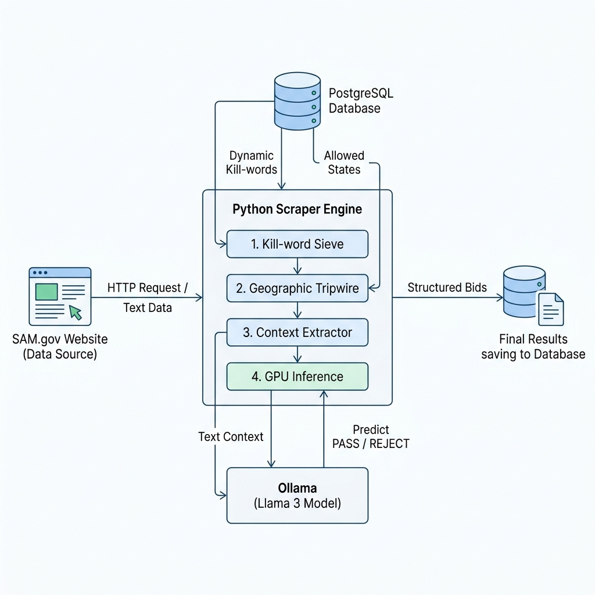

# SAM.gov Scraper & Evaluator Architecture

The SAM.gov module is designed to not only extract contracting bids but also intelligently filter them out using a fast, multi-layer evaluation pipeline before committing them to the database.

## 🏗️ System Flow & Architecture

## 🧠 How Inference Works (The 4 Layers)

When a bid is scraped, the text (both from the web page and any downloaded PDFs/DOCXs) is combined into a massive string in memory (sometimes over 120,000 tokens). To avoid crashing the LLM with massive prompts and to keep inference speeds at milliseconds rather than minutes, we use a funnel approach.

1. **DB Configuration Fetch**: Before evaluating a bid, the system queries the `eval_config` table in PostgreSQL. This allows users to add/remove `kill_words` and `allowed_states` directly from the UI without restarting the server.
2. **Layer 1 (Kill-Word Sieve)**: Fast Python `in` string search. If any word from the DB matches the text (e.g., "IDIQ"), the bid is instantly **REJECTED**.
3. **Layer 2 (Geographic Tripwire)**: Fast Python string search. The system checks if any territory outside your DB's allowed states exists in the text. If the work is localized safely to an allowed state, it instantly **PASSES**.
4. **Layer 3 (Context Extraction)**: If a restricted location (like "Guam") is found, we don't send the whole document to the AI. Instead, we perform a regex slice to grab exactly ~250 words directly surrounding the mention of Guam.
5. **Layer 4 (Ollama Integration)**: The 250-word context slice is fed directly into **Ollama (Llama 3)** running locally via its port `11434` API. The prompt forces the LLM to decide if the context implies a "Service" (Reject) or "Hardware supply" (Pass).

Because 95% of bids are stopped at Layer 1 or 2 using pure Python string searches (< 0.05ms), the heavy GPU inference is rarely invoked, achieving massive performance gains while retaining high accuracy.
